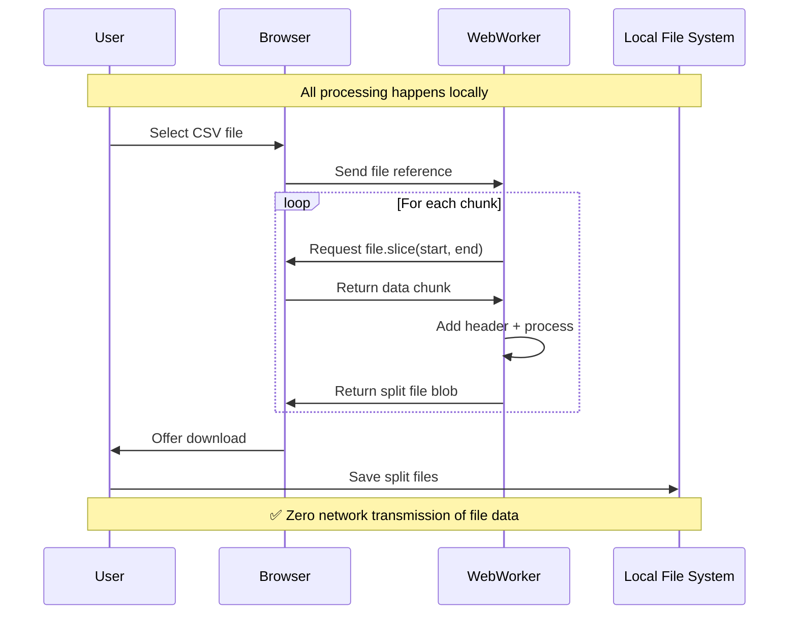

# Split & Ship 🚀

> **Securely split large CSV files directly in your browser. Zero uploads. Zero backend. 100% private.**

[](https://vercel.com/new/clone?repository-url=https://github.com/dataanalystram/spilit-and-ship)

---

## 🔒 Security First: Your Data Never Leaves Your Browser

**Split & Ship** is designed with privacy as the foundational principle. Unlike traditional file processing tools that upload your data to servers, this application processes everything **locally in your browser**.

### Why This Matters for Enterprise & Compliance

| Security Concern | How We Address It |
|-----------------|-------------------|
| **Data Uploads** | ❌ Never happens - no file data sent to any server |
| **Data Persistence** | ❌ Files are never stored - memory cleared after use |
| **Third-Party Access** | ❌ No external APIs, no analytics on file content |
| **Network Transmission** | ❌ Your files never touch the internet |

---

## 🏗️ Architecture

```mermaid
flowchart LR
    subgraph Browser["🖥️ Your Browser (100% Local)"]
        A[Select CSV File] --> B[Web Worker Thread]
        B --> C[File.slice() API]
        C --> D[Process in Chunks]
        D --> E[Generate Output Files]
        E --> F[Download to Your Device]
    end
    
    subgraph Server["☁️ Vercel Static Hosting"]
        G[HTML/CSS/JS Assets Only]
    end
    
    Server -.->|"Load App Once"| Browser
    
    style Browser fill:#e8f5e9,stroke:#4caf50
    style Server fill:#e3f2fd,stroke:#2196f3
```

### Key Technical Points

1. **Static Site Only**: The server (Vercel) only serves static HTML, CSS, and JavaScript files
2. **Web Worker Processing**: File splitting runs in an isolated thread using JavaScript Web Workers
3. **Streaming Architecture**: Uses `File.slice()` to process files chunk-by-chunk without loading the entire file into memory
4. **Memory Management**: All Blob URLs are properly revoked after download to prevent memory leaks

---

## 🛡️ Security Architecture

### Data Flow Diagram



### Security Controls

| Control | Implementation |
|---------|----------------|
| **No Server Upload** | Pure client-side SPA - no backend APIs exist |
| **Isolated Processing** | Web Worker runs in separate thread |
| **Memory Safety** | `URL.revokeObjectURL()` called on cleanup |
| **Large File Handling** | Streaming mode for files >500MB prevents memory exhaustion |
| **Input Validation** | File type checked, CSV header detection |

---

## 📋 How It Works

### Step 1: Select Your File
Drag & drop or click to select any CSV file (supports files up to **10GB+**).

### Step 2: Configure Split Settings

**Gainsight Mode** (Default):
- Pre-configured for Gainsight Rules Engine compatibility
- 200 MB chunk size (Gainsight safe zone)
- Automatic header preservation

**Custom Mode**:
- Adjustable chunk size (1 MB - 2000 MB)
- Custom file prefix for batch identification

### Step 3: Process & Download

1. Click **"Split File Now"**
2. Processing happens entirely in your browser
3. Download ZIP (for smaller files) or individual parts (for files >500MB)

### Technical Processing Flow

```
1. Read CSV header (first line)
2. Calculate optimal split points at line boundaries
3. For each chunk:
   → Slice file at calculated positions
   → Prepend header row
   → Create blob with proper CSV mime type
4. Package as ZIP or stream individual downloads
```

---

## 🌐 Vercel Hosting Security

This application is hosted on **Vercel**, a platform with enterprise-grade security:

| Certification | Details |
|---------------|---------|
| **SOC 2 Type 2** | Audited for Security, Confidentiality & Availability |
| **ISO 27001:2022** | International security standard certified |
| **GDPR Compliant** | EU data protection regulation compliant |
| **Encryption** | AES-256 at rest, TLS 1.3 in transit |
| **DDoS Protection** | Automatic attack mitigation |
| **WAF** | Web Application Firewall included |

### Why Vercel for Static Sites?

Static site hosting is inherently more secure than dynamic servers:
- **No Database**: No SQL injection possible
- **No Server-Side Code**: No remote code execution vectors
- **No User Authentication**: No credential storage risks
- **CDN Distribution**: Fast, reliable, and resilient

---

## 🛠️ Development

### Prerequisites
- Node.js 18+
- npm or yarn

### Local Development
```bash
# Install dependencies
npm install

# Start development server
npm run dev
```

### Production Build
```bash
npm run build
```

### Deploy to Vercel
```bash
# Install Vercel CLI
npm i -g vercel

# Deploy
vercel
```

---

## 📁 Project Structure

```
split-and-save/
├── src/
│   ├── App.tsx           # Main application component
│   ├── worker.ts         # Web Worker for file processing
│   ├── types.ts          # TypeScript definitions
│   ├── components/
│   │   ├── DropZone.tsx  # File upload component
│   │   └── Configuration.tsx  # Settings component
│   └── lib/
│       └── utils.ts      # Utility functions
├── vercel.json           # Vercel deployment config with security headers
├── index.html            # Entry point
└── package.json
```

---

## 🔐 Security Headers

The application is deployed with strict security headers:

| Header | Value | Purpose |
|--------|-------|---------|
| `X-Content-Type-Options` | `nosniff` | Prevent MIME sniffing |
| `X-Frame-Options` | `DENY` | Prevent clickjacking |
| `X-XSS-Protection` | `1; mode=block` | XSS filter |
| `Referrer-Policy` | `strict-origin-when-cross-origin` | Control referrer info |
| `Content-Security-Policy` | Strict policy | Prevent XSS, injection |
| `Permissions-Policy` | Restricted | Limit browser features |

---

## 📜 License

MIT License - Free for personal and commercial use.

---

## 🙋 FAQ

**Q: Is my data really never uploaded?**  
A: Yes. Open your browser's Network tab (F12 → Network) while processing a file. You'll see zero data transmission.

**Q: Can I use this for sensitive/regulated data?**  
A: Yes. Since no data leaves your browser, this is suitable for GDPR, HIPAA, and other compliance scenarios.

**Q: What's the maximum file size?**  
A: Tested up to 10GB+. For very large files (>500MB), the app automatically switches to streaming mode.

**Q: Does it work offline?**  
A: Yes! Once loaded, the app works completely offline.

---

<p align="center">
  <strong>Built with ❤️ for data privacy</strong><br>
  <sub>Your data stays yours. Always.</sub>
</p>
